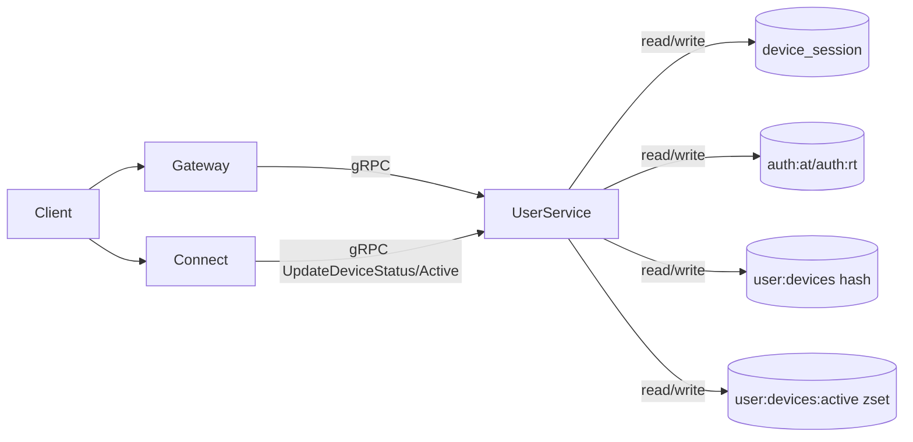

# P0 Device Online System Overview

```mermaid
flowchart LR
    Client --> Gateway
    Client --> Connect
    Gateway -->|gRPC| UserService
    Connect -->|gRPC UpdateDeviceStatus/Active| UserService

    UserService -->|read/write| MySQL[(device_session)]
    UserService -->|read/write| Redis1[(auth:at/auth:rt)]
    UserService -->|read/write| Redis2[(user:devices hash)]
    UserService -->|read/write| Redis3[(user:devices:active zset)]
```
