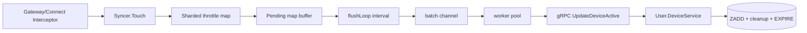

# P0 Active Sync Topology

```mermaid
flowchart LR
    Entry[Gateway/Connect Interceptor] --> Touch[Syncer.Touch]
    Touch --> Throttle[Sharded throttle map]
    Throttle --> Pending[Pending map buffer]
    Pending --> Flush[flushLoop interval]
    Flush --> BatchCh[batch channel]
    BatchCh --> Workers[worker pool]
    Workers --> RPC[gRPC UpdateDeviceActive]
    RPC --> User[User.DeviceService]
    User --> Redis[(ZADD + cleanup + EXPIRE)]
```
