# P0 活跃同步拓扑

**中文说明：** 展示活跃时间同步拓扑：入口触发、节流缓冲、批处理、RPC 上报与 Redis 写入。

## 过程讲解

1. 组件分层：图中从左到右展示调用方、业务服务和存储层，先看主链路再看旁路。
2. 数据流向：箭头表示请求或数据流方向，重点关注跨服务调用点与异步通道（如 Kafka）。
3. 关键依赖：底部存储节点体现最终落点，便于定位一致性边界、性能瓶颈和故障恢复路径。

```mermaid
flowchart LR
    Entry[Gateway/Connect Interceptor] --> Touch[Syncer.Touch]
    Touch --> Throttle[Sharded throttle map]
    Throttle --> Pending[Pending map buffer]
    Pending --> Flush[flushLoop interval]
    Flush --> BatchCh[batch channel]
    BatchCh --> Workers[worker pool]
    Workers --> RPC[gRPC UpdateDeviceActive]
    RPC --> User[User.DeviceService]
    User --> Redis[(ZADD + cleanup + EXPIRE)]
```

