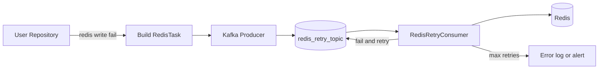

# P0 Redis Retry Compensation Topology

```mermaid
flowchart LR
    Repo[User Repository] -->|redis write fail| TaskBuilder[Build RedisTask]
    TaskBuilder --> Producer[Kafka Producer]
    Producer --> Topic[(redis_retry_topic)]
    Topic --> Consumer[RedisRetryConsumer]
    Consumer --> Redis[(Redis)]
    Consumer -->|fail and retry<max| Topic
    Consumer -->|max retries| DeadLog[Error log or alert]
```
