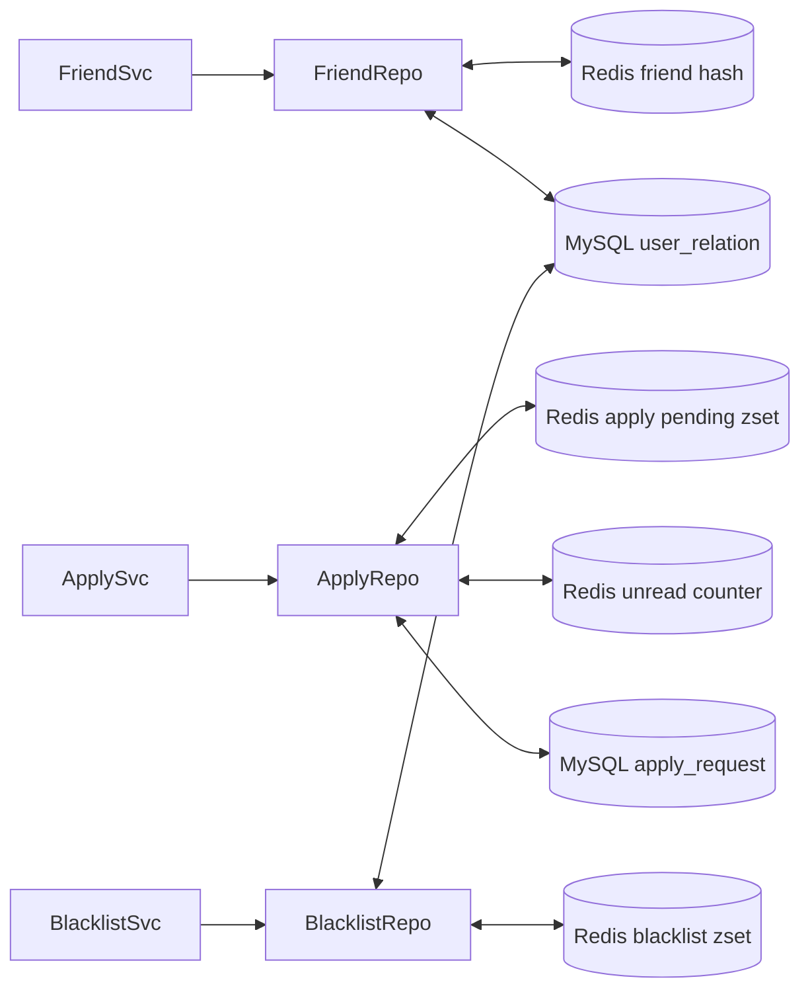

# P1 Social Cache Topology

```mermaid
flowchart LR
    FriendSvc --> FriendRepo
    ApplySvc --> ApplyRepo
    BlacklistSvc --> BlacklistRepo

    FriendRepo <--> RF[(Redis friend hash)]
    ApplyRepo <--> RA[(Redis apply pending zset)]
    ApplyRepo <--> RN[(Redis unread counter)]
    BlacklistRepo <--> RB[(Redis blacklist zset)]

    FriendRepo <--> DB[(MySQL user_relation)]
    ApplyRepo <--> DA[(MySQL apply_request)]
    BlacklistRepo <--> DB
```
