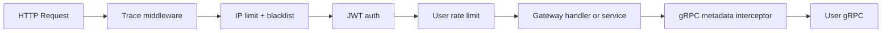

# P1 Gateway请求治理拓扑

**中文说明：** 展示 Gateway 请求治理链：Trace、IP 限流、JWT、用户限流、metadata 透传到 User。

## 过程讲解

1. 组件分层：图中从左到右展示调用方、业务服务和存储层，先看主链路再看旁路。
2. 数据流向：箭头表示请求或数据流方向，重点关注跨服务调用点与异步通道（如 Kafka）。
3. 关键依赖：底部存储节点体现最终落点，便于定位一致性边界、性能瓶颈和故障恢复路径。

