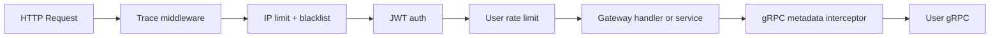

# P1 Gateway Request Governance Topology

```mermaid
flowchart LR
    Req[HTTP Request] --> Trace[Trace middleware]
    Trace --> IP[IP limit + blacklist]
    IP --> JWT[JWT auth]
    JWT --> ULimit[User rate limit]
    ULimit --> Handler[Gateway handler or service]
    Handler --> MD[gRPC metadata interceptor]
    MD --> User[User gRPC]
```
