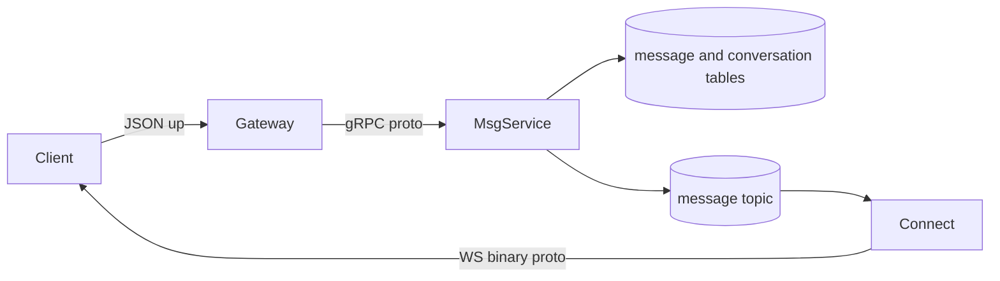

# P0 Planned Message Service Topology

```mermaid
flowchart LR
    Client -->|JSON up| Gateway
    Gateway -->|gRPC proto| MsgService
    MsgService --> MySQL[(message and conversation tables)]
    MsgService --> Kafka[(message topic)]
    Kafka --> Connect
    Connect -->|WS binary proto| Client
```
