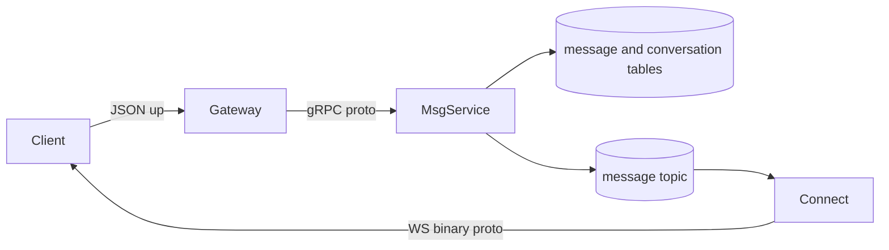

# P0 消息服务端到端拓扑

**中文说明：** 展示规划中的消息服务拓扑：Gateway 到 MsgService，再经 Kafka 到 Connect，最终下发客户端。

## 过程讲解

1. 组件分层：图中从左到右展示调用方、业务服务和存储层，先看主链路再看旁路。
2. 数据流向：箭头表示请求或数据流方向，重点关注跨服务调用点与异步通道（如 Kafka）。
3. 关键依赖：底部存储节点体现最终落点，便于定位一致性边界、性能瓶颈和故障恢复路径。

