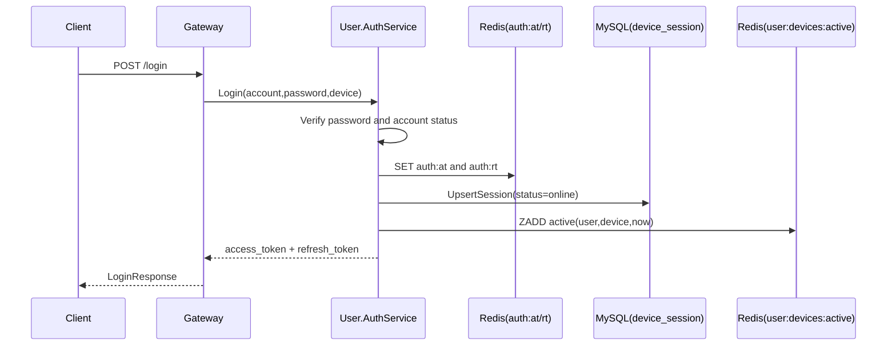

# P0 Login And Auth (Password)

```mermaid
sequenceDiagram
    participant C as Client
    participant G as Gateway
    participant U as User.AuthService
    participant R as Redis(auth:at/rt)
    participant D as MySQL(device_session)
    participant A as Redis(user:devices:active)

    C->>G: POST /login
    G->>U: Login(account,password,device)
    U->>U: Verify password and account status
    U->>R: SET auth:at and auth:rt
    U->>D: UpsertSession(status=online)
    U->>A: ZADD active(user,device,now)
    U-->>G: access_token + refresh_token
    G-->>C: LoginResponse
```
