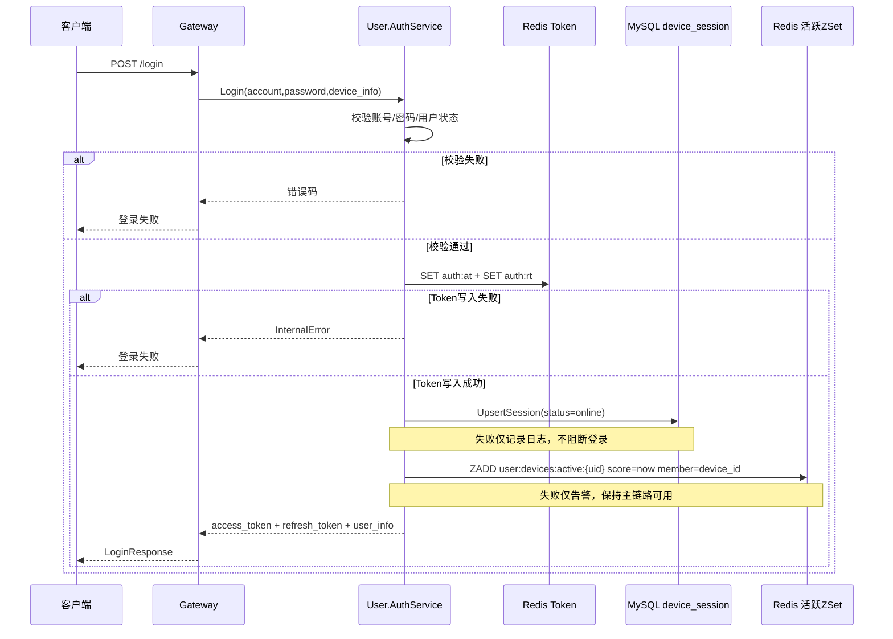

# P0 密码登录与鉴权流程

**中文说明：** 该流程覆盖密码登录成功主链路与关键降级分支。核心目标是先保证鉴权结果和 Token 可用，再尽力完成设备会话与活跃时间写入。

## 前置与关键数据

- 接口入口：`POST /login`
- 令牌键：`auth:at:{user_uuid}:{device_id}`、`auth:rt:{user_uuid}:{device_id}`
- 设备会话表：`device_session`（`status=0` 表示在线）
- 设备活跃键：`user:devices:active:{user_uuid}`（ZSet，`member=device_id`，`score=unix秒`）

## 过程讲解

1. Gateway 转发登录请求到 `User.AuthService.Login`，服务内完成账号存在性、密码和用户状态校验。
2. 校验通过后先生成 `access_token` 与 `refresh_token`，并写入 Redis；这里是强依赖，写入失败直接返回错误。
3. Token 成功后，执行设备会话 `UpsertSession(status=online)`；该步骤失败只记日志，不回滚登录响应。
4. 最后尽力写入设备活跃时间 `ZADD user:devices:active:{uid}`；失败仅告警，不影响登录成功返回。

## 失败语义

- 账号/密码错误或用户状态不合法：直接失败返回。
- Token 写入 Redis 失败：登录失败返回。
- 设备会话或活跃时间写入失败：降级为“登录成功但设备侧数据延迟一致”。

