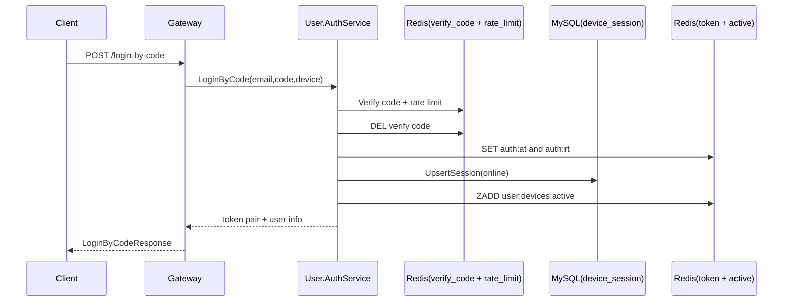

# P0 Login By Verify Code

```mermaid
sequenceDiagram
    participant C as Client
    participant G as Gateway
    participant U as User.AuthService
    participant V as Redis(verify_code + rate_limit)
    participant D as MySQL(device_session)
    participant T as Redis(token + active)

    C->>G: POST /login-by-code
    G->>U: LoginByCode(email,code,device)
    U->>V: Verify code + rate limit
    U->>V: DEL verify code
    U->>T: SET auth:at and auth:rt
    U->>D: UpsertSession(online)
    U->>T: ZADD user:devices:active
    U-->>G: token pair + user info
    G-->>C: LoginByCodeResponse
```
