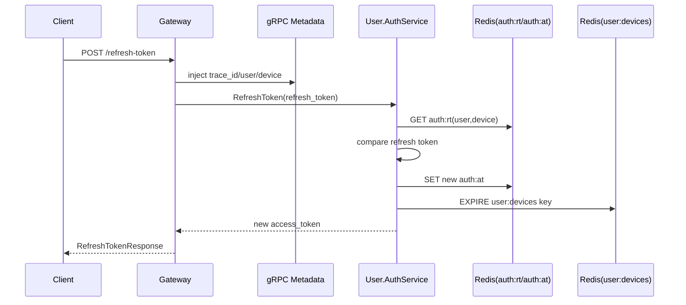

# P0 Refresh Token Flow

```mermaid
sequenceDiagram
    participant C as Client
    participant G as Gateway
    participant M as gRPC Metadata
    participant U as User.AuthService
    participant R as Redis(auth:rt/auth:at)
    participant I as Redis(user:devices)

    C->>G: POST /refresh-token
    G->>M: inject trace_id/user/device
    G->>U: RefreshToken(refresh_token)
    U->>R: GET auth:rt(user,device)
    U->>U: compare refresh token
    U->>R: SET new auth:at
    U->>I: EXPIRE user:devices key
    U-->>G: new access_token
    G-->>C: RefreshTokenResponse
```
