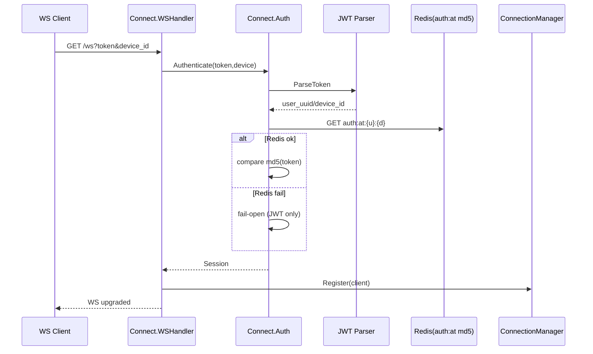

# P0 WebSocket握手鉴权流程

**中文说明：** 展示 WebSocket 握手鉴权：JWT 解析 + Redis 中 auth:at 哈希校验，Redis 异常时采用 fail-open。

## 过程讲解

1. 入口阶段：请求先进入图中的入口组件（客户端、Gateway 或 Connect），完成基础参数与上下文准备。
2. 核心处理：中间组件按时序执行鉴权、校验、路由、批处理或状态更新，关键分支在图中用 `alt/loop` 标注。
3. 结果输出：最终将数据写入目标存储或返回调用方；异常场景通常走降级、重试或丢弃保护逻辑。

