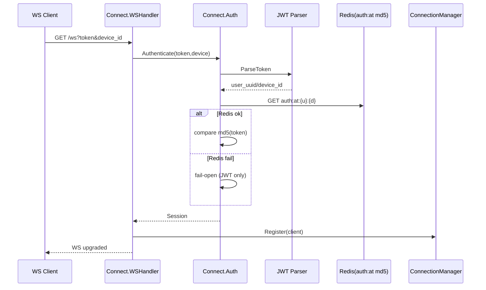

# P0 Connect WS Handshake Auth

```mermaid
sequenceDiagram
    participant C as WS Client
    participant H as Connect.WSHandler
    participant S as Connect.Auth
    participant J as JWT Parser
    participant R as Redis(auth:at md5)
    participant M as ConnectionManager

    C->>H: GET /ws?token&device_id
    H->>S: Authenticate(token,device)
    S->>J: ParseToken
    J-->>S: user_uuid/device_id
    S->>R: GET auth:at:{u}:{d}
    alt Redis ok
        S->>S: compare md5(token)
    else Redis fail
        S->>S: fail-open (JWT only)
    end
    S-->>H: Session
    H->>M: Register(client)
    H-->>C: WS upgraded
```
