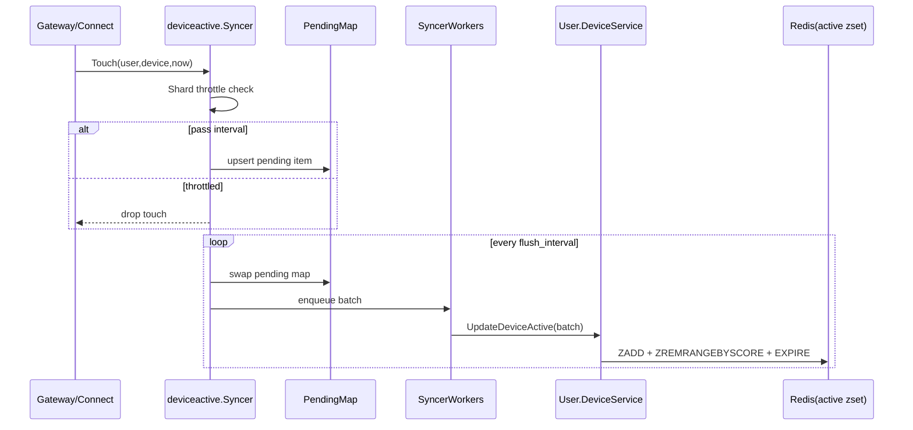

# P0 Device Active Heartbeat Flow

```mermaid
sequenceDiagram
    participant GW as Gateway/Connect
    participant SY as deviceactive.Syncer
    participant PM as PendingMap
    participant WK as SyncerWorkers
    participant U as User.DeviceService
    participant R as Redis(active zset)

    GW->>SY: Touch(user,device,now)
    SY->>SY: Shard throttle check
    alt pass interval
        SY->>PM: upsert pending item
    else throttled
        SY-->>GW: drop touch
    end

    loop every flush_interval
        SY->>PM: swap pending map
        SY->>WK: enqueue batch
        WK->>U: UpdateDeviceActive(batch)
        U->>R: ZADD + ZREMRANGEBYSCORE + EXPIRE
    end
```
