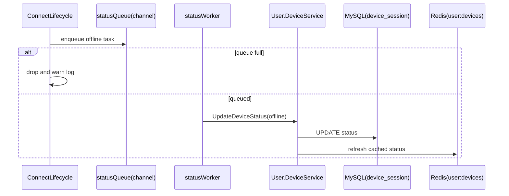

# P0 Disconnect Status Async Queue

```mermaid
sequenceDiagram
    participant C as ConnectLifecycle
    participant Q as statusQueue(channel)
    participant W as statusWorker
    participant U as User.DeviceService
    participant D as MySQL(device_session)
    participant R as Redis(user:devices)

    C->>Q: enqueue offline task
    alt queue full
        C->>C: drop and warn log
    else queued
        W->>U: UpdateDeviceStatus(offline)
        U->>D: UPDATE status
        U->>R: refresh cached status
    end
```
