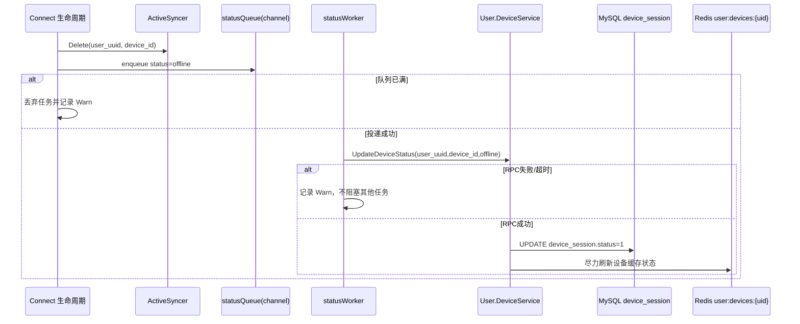

# P0 断连状态异步同步流程

**中文说明：** 该流程描述 Connect 在连接断开时如何以“非阻塞优先”方式异步同步设备离线状态，避免影响连接主线程和资源回收。

## 前置与关键数据

- 触发点：`ConnectService.OnDisconnect`
- 队列：`statusQueue`（`channel`，容量有限）
- 消费模型：多 `worker` 并发消费，每个任务独立 `3s` 超时
- RPC：`User.DeviceService.UpdateDeviceStatus(status=offline)`

## 过程讲解

1. 连接断开后，Connect 先清理本地活跃节流缓存，然后投递一条“离线状态”任务到 `statusQueue`。
2. 若队列已满，任务直接丢弃并打 `Warn` 日志，保证断连路径不被阻塞。
3. Worker 从队列取任务后调用 `UpdateDeviceStatus`，User 侧更新 `device_session.status=1`，并尽力同步设备缓存状态。
4. RPC 失败时仅记录告警，不反向重试连接逻辑，保持“连接生命周期优先完成”。

## 一致性与降级

- 该链路设计目标是“最终一致”，不是强一致事务。
- 队列满或 RPC 失败会导致状态短暂滞后，但不会拖慢连接读写主路径。

