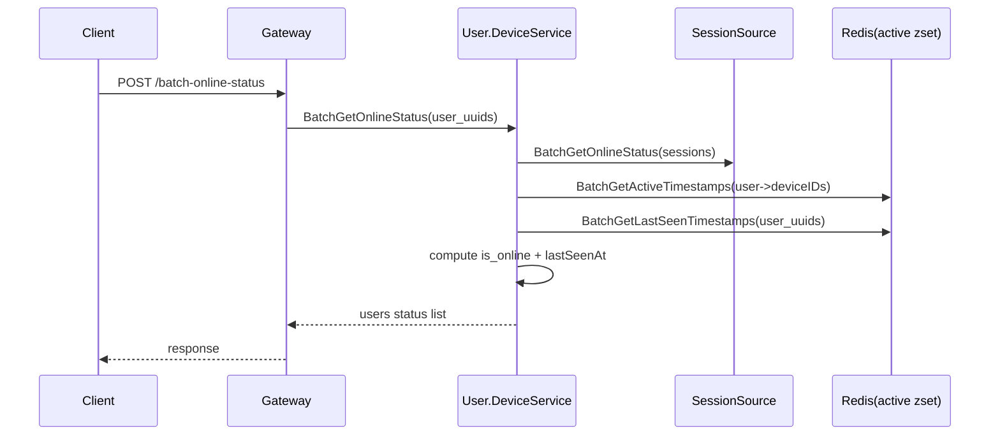

# P0 Batch Online Status Query

```mermaid
sequenceDiagram
    participant C as Client
    participant G as Gateway
    participant U as User.DeviceService
    participant S as SessionSource
    participant A as Redis(active zset)

    C->>G: POST /batch-online-status
    G->>U: BatchGetOnlineStatus(user_uuids)
    U->>S: BatchGetOnlineStatus(sessions)
    U->>A: BatchGetActiveTimestamps(user->deviceIDs)
    U->>A: BatchGetLastSeenTimestamps(user_uuids)
    U->>U: compute is_online + lastSeenAt
    U-->>G: users status list
    G-->>C: response
```
