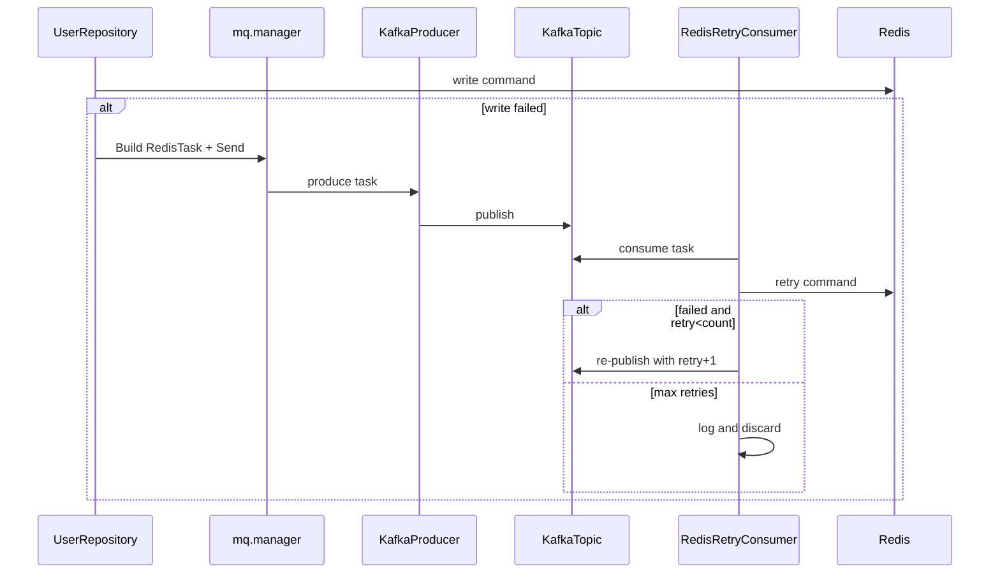

# P0 Redis Write Failure Retry (Kafka)

```mermaid
sequenceDiagram
    participant RE as UserRepository
    participant RM as mq.manager
    participant KP as KafkaProducer
    participant KT as KafkaTopic
    participant KC as RedisRetryConsumer
    participant R as Redis

    RE->>R: write command
    alt write failed
        RE->>RM: Build RedisTask + Send
        RM->>KP: produce task
        KP->>KT: publish
        KC->>KT: consume task
        KC->>R: retry command
        alt failed and retry<count
            KC->>KT: re-publish with retry+1
        else max retries
            KC->>KC: log and discard
        end
    end
```
