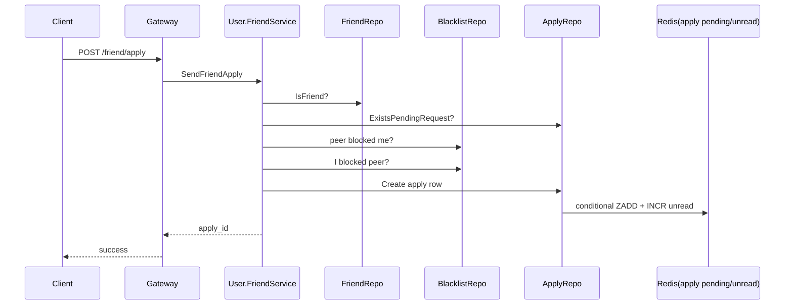

# P1 Send Friend Apply

```mermaid
sequenceDiagram
    participant C as Client
    participant G as Gateway
    participant F as User.FriendService
    participant FR as FriendRepo
    participant BR as BlacklistRepo
    participant AR as ApplyRepo
    participant R as Redis(apply pending/unread)

    C->>G: POST /friend/apply
    G->>F: SendFriendApply
    F->>FR: IsFriend?
    F->>AR: ExistsPendingRequest?
    F->>BR: peer blocked me?
    F->>BR: I blocked peer?
    F->>AR: Create apply row
    AR->>R: conditional ZADD + INCR unread
    F-->>G: apply_id
    G-->>C: success
```
