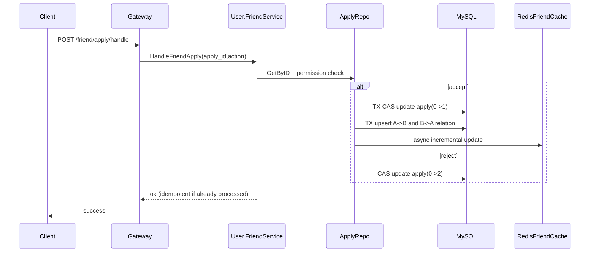

# P1 Handle Friend Apply (CAS + TX)

```mermaid
sequenceDiagram
    participant C as Client
    participant G as Gateway
    participant F as User.FriendService
    participant AR as ApplyRepo
    participant DB as MySQL
    participant RC as RedisFriendCache

    C->>G: POST /friend/apply/handle
    G->>F: HandleFriendApply(apply_id,action)
    F->>AR: GetByID + permission check
    alt accept
        AR->>DB: TX CAS update apply(0->1)
        AR->>DB: TX upsert A->B and B->A relation
        AR->>RC: async incremental update
    else reject
        AR->>DB: CAS update apply(0->2)
    end
    F-->>G: ok (idempotent if already processed)
    G-->>C: success
```
