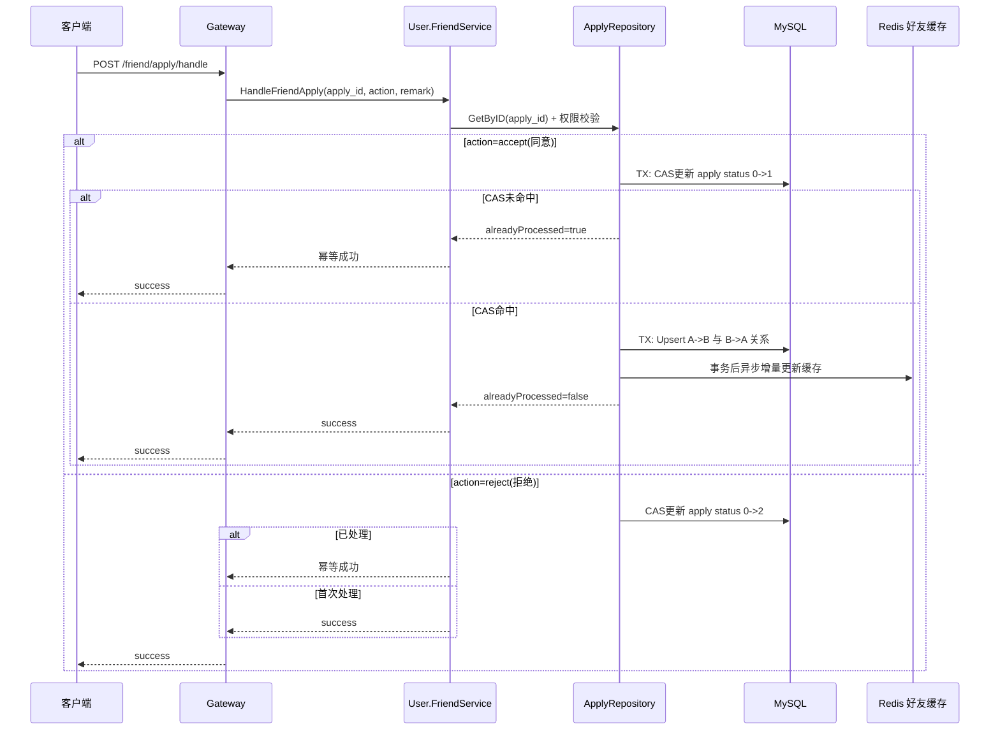

# P1 处理好友申请事务幂等流程

**中文说明：** 该流程重点是“并发幂等”和“关系一致性”：同一申请被重复处理时，不会重复建关系，也不会把系统打到错误状态。

## 前置与关键数据

- 入口接口：`POST /friend/apply/handle`
- 关键守门条件：`apply.status=0`（待处理）
- 同意动作：事务内完成 `CAS 更新申请状态 + 双向好友关系 Upsert`
- 拒绝动作：仅做 `CAS` 状态更新，不建关系

## 过程讲解

1. 服务先根据 `apply_id` 查询申请并校验处理权限（只能由 `target_uuid` 处理）。
2. 若是同意，仓储层在一个事务内先执行 `WHERE status=0` 的 CAS 更新，再 Upsert 双向关系。
3. 若 CAS 未命中（说明已被他人或自己处理过），返回“已处理”并按幂等成功结束。
4. 事务成功后异步刷新好友缓存，缓存刷新失败不回滚数据库事务。
5. 若是拒绝，仅更新申请状态（同样用 CAS），已处理场景也按幂等成功返回。

## 幂等保证点

- 并发点击“同意/拒绝”不会重复修改申请。
- 同意链路只会在首次 CAS 成功时创建关系。
- 关系缓存为异步增量更新，数据库状态始终作为最终权威。

