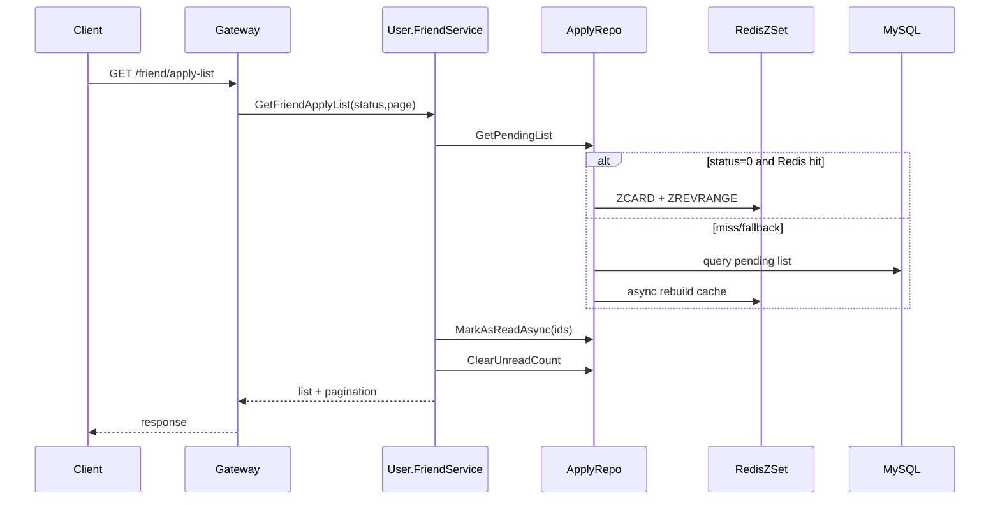

# P1 Friend Apply List (Hot/Cold)

```mermaid
sequenceDiagram
    participant C as Client
    participant G as Gateway
    participant F as User.FriendService
    participant A as ApplyRepo
    participant R as RedisZSet
    participant D as MySQL

    C->>G: GET /friend/apply-list
    G->>F: GetFriendApplyList(status,page)
    F->>A: GetPendingList
    alt status=0 and Redis hit
        A->>R: ZCARD + ZREVRANGE
    else miss/fallback
        A->>D: query pending list
        A->>R: async rebuild cache
    end
    F->>A: MarkAsReadAsync(ids)
    F->>A: ClearUnreadCount
    F-->>G: list + pagination
    G-->>C: response
```
