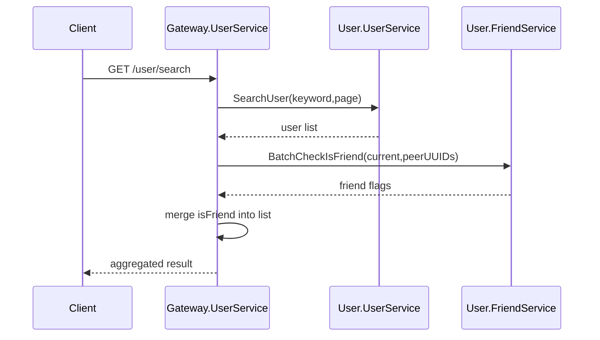

# P1 Search User Aggregation

```mermaid
sequenceDiagram
    participant C as Client
    participant G as Gateway.UserService
    participant U as User.UserService
    participant F as User.FriendService

    C->>G: GET /user/search
    G->>U: SearchUser(keyword,page)
    U-->>G: user list
    G->>F: BatchCheckIsFriend(current,peerUUIDs)
    F-->>G: friend flags
    G->>G: merge isFriend into list
    G-->>C: aggregated result
```
