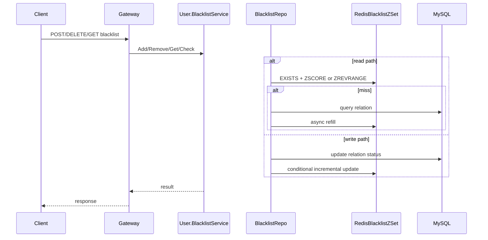

# P1 Blacklist Read Write Flow

```mermaid
sequenceDiagram
    participant C as Client
    participant G as Gateway
    participant B as User.BlacklistService
    participant R as BlacklistRepo
    participant Z as RedisBlacklistZSet
    participant D as MySQL

    C->>G: POST/DELETE/GET blacklist
    G->>B: Add/Remove/Get/Check
    alt read path
        R->>Z: EXISTS + ZSCORE or ZREVRANGE
        alt miss
            R->>D: query relation
            R->>Z: async refill
        end
    else write path
        R->>D: update relation status
        R->>Z: conditional incremental update
    end
    B-->>G: result
    G-->>C: response
```
