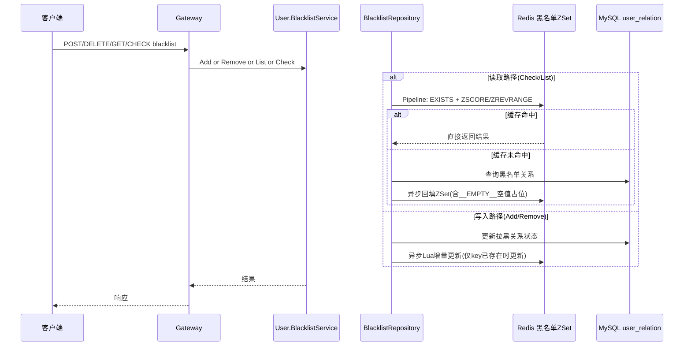

# P1 黑名单读写流程

**中文说明：** 该流程展示黑名单能力的“Redis 优先 + DB 回源 + 异步缓存维护”模型，覆盖 `Check`、`List`、`Add`、`Remove` 四类典型场景。

## 前置与关键数据

- 黑名单键：`user:relation:blacklist:{user_uuid}`（ZSet）
- ZSet 含义：`member=target_uuid`，`score=blacklisted_at(unix毫秒)`
- 空值占位：`__EMPTY__`（用于防穿透）
- 关系表状态：拉黑相关状态由 `user_relation.status in (1,3)` 表示

## 过程讲解

1. 读取路径（`Check/List`）优先走 Redis：通过 `EXISTS + ZSCORE` 或 `ZREVRANGE` 判断命中并返回。
2. 当缓存未命中时回源 MySQL，并异步回填 ZSet；无数据时写入 `__EMPTY__` 作为空值缓存。
3. 写入路径（`Add/Remove`）先更新 DB，再用 Lua 做“仅在 key 已存在时”的增量缓存更新，避免把不存在的缓存硬拉起造成脏扩散。
4. 读写过程都带降级处理：Redis 异常时走 DB；缓存异步更新失败不影响主事务结果。

## 一致性说明

- DB 是最终权威，Redis 是读优化层。
- 读路径命中缓存时可快速返回，未命中会触发回源补齐。
- 写路径通过“先 DB 后缓存”降低错误缓存覆盖权威数据的风险。

