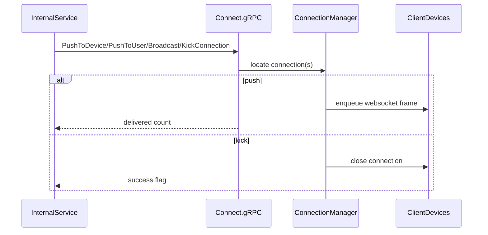

# P1 Connect Internal Push Flow

```mermaid
sequenceDiagram
    participant S as InternalService
    participant CG as Connect.gRPC
    participant M as ConnectionManager
    participant CL as ClientDevices

    S->>CG: PushToDevice/PushToUser/Broadcast/KickConnection
    CG->>M: locate connection(s)
    alt push
        M->>CL: enqueue websocket frame
        CG-->>S: delivered count
    else kick
        M->>CL: close connection
        CG-->>S: success flag
    end
```
