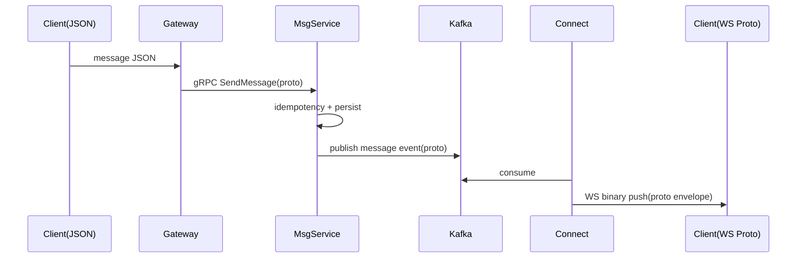

# P0 Planned E2E Message Flow (JSON Up, Proto Down)

```mermaid
sequenceDiagram
    participant C as Client(JSON)
    participant G as Gateway
    participant M as MsgService
    participant K as Kafka
    participant X as Connect
    participant W as Client(WS Proto)

    C->>G: message JSON
    G->>M: gRPC SendMessage(proto)
    M->>M: idempotency + persist
    M->>K: publish message event(proto)
    X->>K: consume
    X->>W: WS binary push(proto envelope)
```
