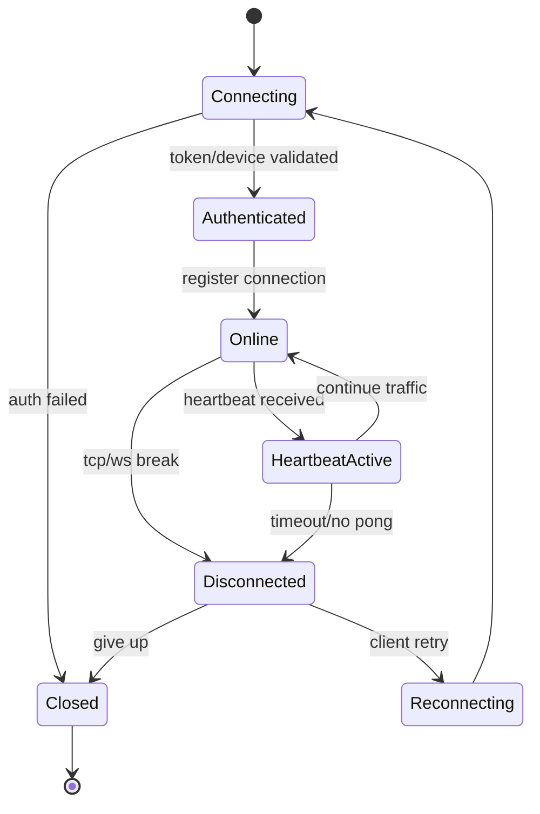

# P0 Connect Connection Lifecycle

```mermaid
stateDiagram-v2
    [*] --> Connecting
    Connecting --> Authenticated: token/device validated
    Connecting --> Closed: auth failed
    Authenticated --> Online: register connection
    Online --> HeartbeatActive: heartbeat received
    HeartbeatActive --> Online: continue traffic
    Online --> Disconnected: tcp/ws break
    HeartbeatActive --> Disconnected: timeout/no pong
    Disconnected --> Reconnecting: client retry
    Reconnecting --> Connecting
    Disconnected --> Closed: give up
    Closed --> [*]
```
