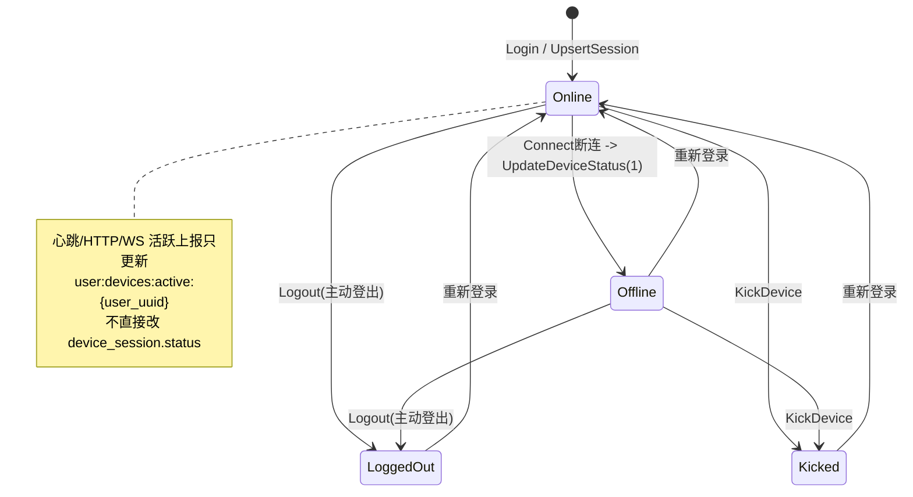

# P0 设备业务状态机

**中文说明：** 该状态机描述 `device_session.status` 的业务语义与迁移规则。活跃时间上报（`UpdateDeviceActive`）不改变此状态，只更新 Redis 活跃时间。

## 状态定义

- `Online(0)`：设备在线，可参与在线判定。
- `Offline(1)`：连接断开后的离线态，通常由 Connect 异步上报。
- `LoggedOut(2)`：用户主动登出后状态。
- `Kicked(3)`：被用户手动踢下线后的状态。

## 过程讲解

1. 设备登录成功后进入 `Online`，来源可以是首次登录或重新登录。
2. 连接断开会触发 `Online -> Offline`，该迁移来自 `UpdateDeviceStatus(offline)` 的异步任务。
3. 主动登出会进入 `LoggedOut`，可从在线或离线态触发。
4. 踢设备会进入 `Kicked`，可从在线或离线态触发。
5. `Kicked/LoggedOut/Offline` 在后续重新登录时都可回到 `Online`。

## 约束与备注

- `UpdateDeviceStatus` 仅允许写入 `Online(0)` 和 `Offline(1)`。
- `LoggedOut(2)` 与 `Kicked(3)` 由业务动作（登出/踢设备）驱动，不由心跳驱动。
- 在线判定需要同时满足“状态=Online”和“活跃时间在在线窗口内”。

