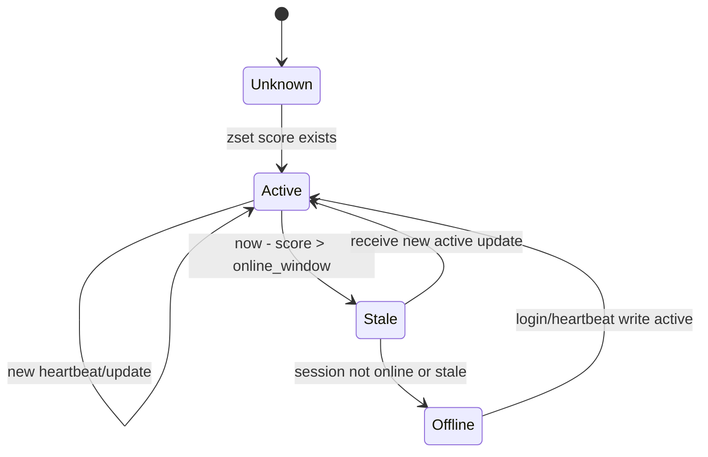

# P0 Active And Online Window Status

```mermaid
stateDiagram-v2
    [*] --> Unknown
    Unknown --> Active: zset score exists
    Active --> Active: new heartbeat/update
    Active --> Stale: now - score > online_window
    Stale --> Offline: session not online or stale
    Stale --> Active: receive new active update
    Offline --> Active: login/heartbeat write active
```
