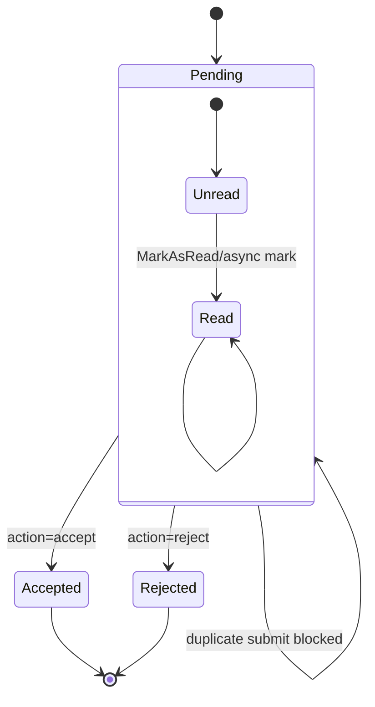

# P1 好友申请状态机

**中文说明：** 展示好友申请状态机：Pending 到 Accepted/Rejected，以及 is_read 的独立流转。

## 过程讲解

1. 初始状态：从 `[ * ]` 进入系统初始态，表示对象刚创建或刚建立连接时的默认状态。
2. 迁移条件：每条箭头代表一次状态迁移，触发条件通常是事件输入、超时、校验结果或业务操作。
3. 收敛与回环：终态表示流程结束；回环表示系统会在运行期持续重复该状态转换。

