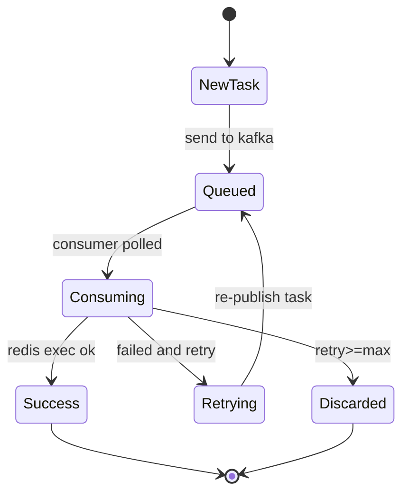

# P1 Redis Retry Task Status

```mermaid
stateDiagram-v2
    [*] --> NewTask
    NewTask --> Queued: send to kafka
    Queued --> Consuming: consumer polled
    Consuming --> Success: redis exec ok
    Consuming --> Retrying: failed and retry<max
    Retrying --> Queued: re-publish task
    Consuming --> Discarded: retry>=max
    Success --> [*]
    Discarded --> [*]
```
