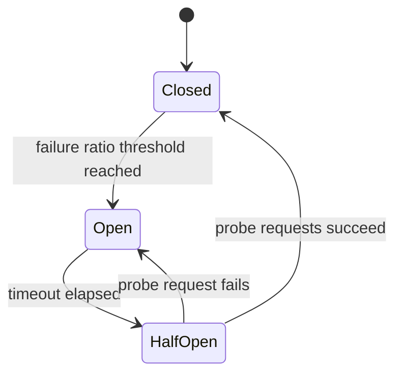

# P2 gRPC熔断状态机

**中文说明：** 展示 gRPC 熔断状态：Closed、Open、HalfOpen 之间的触发与恢复条件。

## 过程讲解

1. 初始状态：从 `[ * ]` 进入系统初始态，表示对象刚创建或刚建立连接时的默认状态。
2. 迁移条件：每条箭头代表一次状态迁移，触发条件通常是事件输入、超时、校验结果或业务操作。
3. 收敛与回环：终态表示流程结束；回环表示系统会在运行期持续重复该状态转换。

