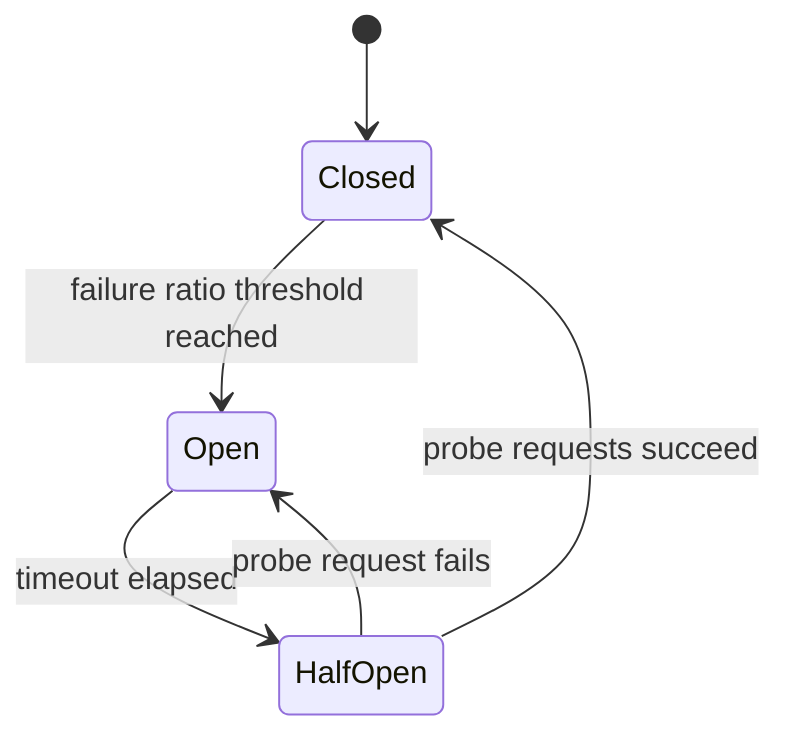

# P2 gRPC Circuit Breaker State

```mermaid
stateDiagram-v2
    [*] --> Closed
    Closed --> Open: failure ratio threshold reached
    Open --> HalfOpen: timeout elapsed
    HalfOpen --> Closed: probe requests succeed
    HalfOpen --> Open: probe request fails
```
